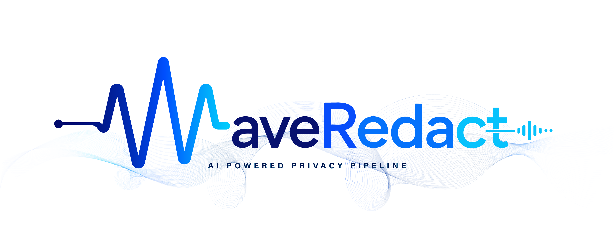

<div align="center">

  <p>
    <strong>An advanced architecture for the anonymization and protection of sensitive data (PII) in transcriptions.</strong>
  </p>

  <p>
    WaveRedact leverages a hybrid pipeline combining compact NER models (GLiNER) with <strong>strictly local Large Language Models</strong> (via <i>llama.cpp</i>). Designed to identify, validate, and redact personal information with surgical precision and auto-correction of hallucinations, ensuring your data <strong>never</strong> leaves your machine.
  </p>

</div>

<div align="center">
  <p>
      
      
      
  </p>
</div>

## What it does

- Transcribes local audio with Whisper.
- Detects potential sensitive data with PII extractors.
- Redacts the matched spans by replacing them with silence or beep.
- Saves the resulting file with the `_censored` suffix.
- Can optionally use an LLM to improve precision.

## Requirements

- Python 3.11 or later.
- At least 6.69GB of free disk space for the bundled local models included in the repository.
- Extra disk space for your audio files and for the first Whisper model download if it is not already cached locally.
- **`ffmpeg` installed and available in your system's `PATH`.** This is strictly required by the underlying audio processing engine to decode and slice the media files.
  - **Windows:** Open PowerShell or Command Prompt as Administrator and run:
    ```bash
    winget install ffmpeg
    ```
    *(Note: You must close and reopen your terminal after installation to refresh the PATH).*
  - **macOS:**
    ```bash
    brew install ffmpeg
    ```
  - **Linux (Ubuntu/Debian):**
    ```bash
    sudo apt update && sudo apt install ffmpeg
    ```

If you want to use the GPU, the project will try to take advantage of it; if it is not available, the CLI can continue in CPU mode.

## Installation

From a shell in the project folder:

### With `uv` (recommended)

If you already use `uv`, the setup is the simplest path: `uv sync` now installs the project itself, so the `waveredact` command becomes available after synchronization.

```bash
uv sync
```

Then run the CLI directly from the project environment:

```bash
waveredact
```

If you also want the web interface:

```bash
uv sync --extra web
```

And then:

```bash
waveredact-web
```

If your shell does not pick up the commands directly, use uv run waveredact or activate the generated .venv first.

### With `venv` and `pip`

```bash
python -m venv .venv
.venv\Scripts\activate
pip install -e .
```

If you also want the web interface:

```bash
pip install -e ".[web]"
```

## Using the CLI

The main CLI entry point is `waveredact`.

```bash
waveredact
```

By default, you must specify the input using either the `--file` or `--folder` option. Supported audio formats are:

- .mp3
- .wav
- .flac
- .m4a
- .ogg

The censored file is automatically saved in a `censored/` directory created right next to your input file/folder, with the original name plus `_censored`.

### Available options

```bash
waveredact --file path/to/audio.mp3 --auto
waveredact --folder path/to/audios/ --level base --auto
waveredact --folder path/to/audios/ --level medium --auto
waveredact --folder path/to/audios/ --level total --auto
waveredact --file path/to/audio.mp3 --use-llm
```

- `--file` specifies a single audio file to process.
- `--folder` specifies a directory containing audio files to process. (You must provide exactly one between `--file` and `--folder`).
- `--auto` disables interactive mode and applies the "total" level as default without asking for confirmation.

- `--level` defines how aggressive the redaction should be when using --auto.

  - `base` removes secrets and payment data.
    - **Labels:** `password`, `api_key`, `secret`, `access_token`, `recovery_code`, `iban`, `bank_account`, `account_number`, `routing_number`, `payment_card`, `card_number`, `card_expiry`, `card_cvv`

  - `medium` adds names, email addresses, phone numbers, and documents.
    - **Labels:** (All from base) + `person`, `full_name`, `first_name`, `middle_name`, `last_name`, `username`, `email`, `phone_number`, `ip_address`, `account_id`, `sensitive_account_id`, `government_id`, `national_id_number`, `passport_number`, `drivers_license_number`, `tax_id`, `tax_number`, `date_of_birth`

  - `total` extends redaction to addresses and time-related references. (default)
    - **Labels:** (All from medium) + `address`, `street_address`, `city`, `state_or_region`, `postal_code`, `country`, `sensitive_date`, `document_date`, `expiration_date`, `transaction_date`, `license_number`

- `--use-llm` enables the optional LLM component to improve detection.
- `--mode` defines how to censor the sensitive data.
  - `muted`replace sensitive data with silence. (default)
  - `beep` replace sensitive data with beep sound.

### Example workflow

1. Run the command pointing to your audio file or folder, for example `waveredact --file my_recording.wav --auto --level total`.

2. Wait for transcription and redaction.

3. Retrieve the result from the newly created `censored/` folder next to your original file.

## Using the web interface
The project also includes a FastAPI server with a simple web interface.

Start it with:

```bash
waveredact-web
```

The server runs locally at `http://127.0.0.1:8000`.

The interface lets you upload an audio file and receive the analysis of the sensitive content it found.

## Expected output
When processing finishes, the CLI prints the path of the generated file. You will usually see a message like:

```plaintext
✅ File saved: path/to/your/audio/censored/file_name_censored.mp3
```

## Folder structure

- `files/`: uploads and temporary data for the web interface.
- `web/`: web interface and API.

*Note: Heavy machine learning models (GLiNER, LLMs) are downloaded automatically on first run and stored in a persistent application data folder (`~/.waveredact` on Unix or `%APPDATA%\WaveRedact` on Windows).*

## Common issues
- `FileNotFoundError: [WinError 2]` or `Couldn't find ffprobe or avprobe`: You are missing `ffmpeg`. Follow the instructions in the Requirements section to install it, then completely close and reopen your terminal.

- **Nothing happens**: Make sure there are supported audio files inside `audio/`.

- **LLM Server doesn't start**: If you use `--use-llm` and the LLM server fails to initialize (e.g., due to port conflicts or missing files), WaveRedact will safely fallback and continue without that component.

## Performance & Benchmarks

WaveRedact has been evaluated against a synthetic "Golden Dataset" of 120 diverse phrases containing multiple categories of PII across different contexts. The architecture provides two modes depending on your security needs:

| Mode | Precision | Recall | F1-Score |
| :--- | :---: | :---: | :---: |
| **Fast Mode** (Regex + GLiNER2) | 44.04% | 39.55% | 41.68% |
| **Max Security** (Regex + GLiNER2 + LLM) | 68.82% | 90.05% | 78.02% |

**Why the LLM makes a difference:**
As shown in the benchmarks, while compact models (GLiNER2) are incredibly fast, they can sometimes over-censor generic words (False Positives) or miss highly ambiguous context. By adding the local LLM as a final verification layer, WaveRedact actively fixes hallucinations and guarantees maximum surgical precision, ensuring you only redact what is truly sensitive.

## 🙏 Acknowledgments & Core Technologies

WaveRedact is built upon several outstanding open-source projects. We would like to express our deepest gratitude to the creators and maintainers of these technologies:

* **[GLiNER2](https://github.com/fastino-ai/GLiNER2)** by Urchade Zaratiana et al. - The foundation of our initial PII extraction stage, providing fast and versatile zero-shot Named Entity Recognition.
* **[Faster-Whisper](https://github.com/SYSTRAN/faster-whisper)** by SYSTRAN - Powering our rapid and accurate audio transcription pipeline using CTranslate2.
* **[llama.cpp](https://github.com/ggml-org/llama.cpp)** by Georgi Gerganov and the ggml community - Enabling lightning-fast, entirely local execution of our validation LLMs with minimal hardware requirements.

If you are using WaveRedact in academic research, please consider citing these foundational works as well.


## 🤝 Contributing

Thank you for your interest in WaveRedact 💙

Currently, this is a personal open-source project developed and maintained independently by a solo developer. Because I am managing all aspects of the architecture, testing, and development on my own, my bandwidth to review and merge large code contributions (Pull Requests) is currently limited.

However, I am completely open to community feedback, ideas, and constructive help! Here is how you can best contribute:
* **Bug Reports:** If you find a bug, a memory leak, or a blind spot in the PII extraction pipeline, please open an Issue with reproducible steps or logs.
* **Ideas & Suggestions:** Have a proposal for a new feature, a performance optimization, or a better regex pattern? Open an Issue so we can discuss it!
* **Code Contributions:** If you would like to submit code, please open an Issue *first* to discuss your implementation idea before spending your valuable time on a Pull Request. This ensures our architectural visions align and your effort isn't wasted.

⭐ I deeply appreciate every star, bug report, and piece of feedback from the community!

## 📝 Citation

If you use WaveRedact in your research, thesis, or software pipeline, please cite this repository. 

**Plain Text:**
> Andrea-Difino, (2026). WaveRedact: An open-source local AI pipeline for audio PII redaction. GitHub. https://github.com/Andrea-Difino/WaveRedact

**BibTeX:**
```bibtex
@software{WaveRedact_2026,
  author = {Andrea Difino},
  title = {WaveRedact: An open-source local AI pipeline for audio PII redaction},
  year = {2026},
  publisher = {GitHub},
  journal = {GitHub repository},
  howpublished = {\url{https://github.com/Andrea-Difino/WaveRedact}}
}
```

## License
This project is distributed under the terms of the license included in the repository.
